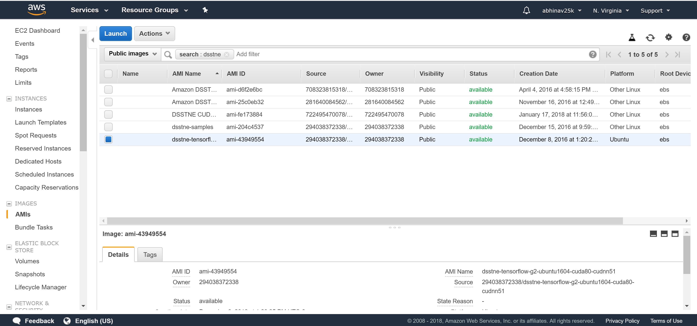
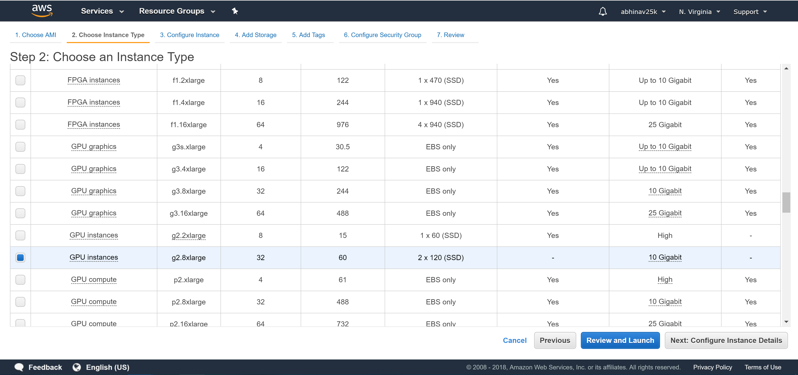
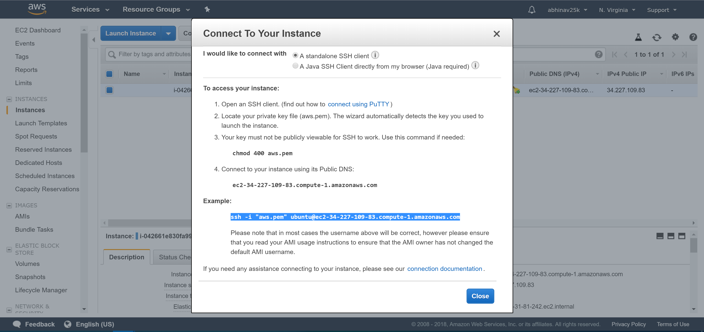

# DSSTNE Walkthrough

Amazon's GitHub page has a walkthrough on how to set up DSSTNE but we faced few challenges while following their implementation. Below we have given an overview of the steps we took to get DSSTNE running.

## Setup

#### Launch an EC2 instance from AWS Marketplace

Start an EC2 GPU-based instance from the AWS marketplace. DSSTNE requires
that the instance have CUDA, cuDNN and few other dependencies. This process is
tedious but there are multiple AMIs of DSSTNE available in the EC2 public instances which have all of the dependencies for building DSSTNE. AWS keeps releasing new versions with minor updates and bug fixes, the most stable version was found by following the steps mentioned below. 

  - Select the instance *ami-43949554* from
    [here](https://console.aws.amazon.com/ec2/v2/home?region=us-east-1#LaunchInstanceWizard:ami=ami-43949554).
    This AMI also includes NVIDIA drivers and is currently available in
    the us-east-1 region (N.Virginia in AWS Console)



  - Choose the GPU-based instance



  - Select the other attributes of the instance as per the requirement
    and launch it. For the purposes of this demo, only the storage was
    modified to 200GB from the default values setup

  - SSH into the cluster from the location where the private key is
    located



## Running the recommender system

Since the required components are already incorporated into the
instance, we can directly proceed to the implementation of the
recommender system. For this example, we will generate movie recommendations based on the [MovieLens](https://grouplens.org/datasets/movielens/) dataset.

  - Download data from the URL

<!-- end list -->

``` bash
cd amazon-dsstne/samples/movielens/

wget http://files.grouplens.org/datasets/movielens/ml-10m.zip
```

  - Unzip the data and understand how the data looks

<!-- end list -->

``` bash
unzip -p ml-20m.zip ml-10M100K/ratings.dat > ml-10m_ratings.dat

head ml-10m_ratings.dat
```

    1::122::5::838985046
    1::185::5::838983525
    1::231::5::838983392
    1::292::5::838983421
    1::316::5::838983392
    1::329::5::838983392
    1::355::5::838984474
    1::356::5::838983653
    1::362::5::838984885
    1::364::5::838983707

  - Convert the .dat data to a format that is recognized by
    generateNetCDF. The data should be structured such that the sample
    name is followed by a tab character and a list of the features
    delimited by a colon character(:)

<!-- end list -->

``` bash
awk -f convert_ratings.awk ml-10m_ratings.dat > ml-10m_ratings
```

  - Generate the NetCDF input file which will be used by
DSSTNE

<!-- end list -->

``` bash
generateNetCDF -d gl_input -i ml-10m_ratings -o gl_input.nc -f features_input -s samples_input -c
```

This will create the following files:

1.  gl\_input.nc : NetCDF file in the format which DSSTNE Engine
    understand
2.  features\_input : An index file with the indexes of each neuron
3.  samples\_input : An index file with the indexes of all samples

<!-- end list -->

  - Generate the NetCDF output file which will be used to map to the
    index of the sample file used for
testing

<!-- end list -->

``` bash
generateNetCDF -d gl_output -i ml-10m_ratings -o gl_output.nc -f features_output -s samples_input -c
```

  - Training the neural network using the config.json file. This file
    can be used to tweak the number of layers, batch-size and the epochs of the neural networks. We will now train a 3-layer Neural Network with one 128 node hidden layer with Sigmoid as an activation function as specified in the config.json file. The model file generated will be a .nc file.
    The model is currently generated using a batch size of 256 and epoch
    of 10

<!-- end list -->

``` bash
train -c config.json -i gl_input.nc -o gl_output.nc -n gl.nc -b 256 -e 10
```

  - Once the model has finished training, we can predict on the sample
    dataset

<!-- end list -->

``` bash
predict -b 256 -d gl -i features_input -o features_output -k 10 -n gl.nc -f ml-10m_ratings -s recs -r ml-10m_ratings
```

## Results

Using the 10 million movie review dataset DSSTNE takes 20 seconds which is 16 times faster than TensorFlow.
