# Introduction


To deploy our implementation of recommender systems pipeline we started with the pre-processing of the data for our machine learning exercise.

The dataset being considered is the MovieLens dataset which contains movie rating information. The data is available at the following link: [data](https://grouplens.org/datasets/movielens/20m/)

More about data:
Stable benchmark dataset. 20 million ratings and 465,000 tag applications applied to 27,000 movies by 138,000 users. Includes tag genome data with 12 million relevance scores across 1,100 tags. 

More about the AWS technologies being used for analysis:

**Amazon Simple Storage Service (Amazon S3)** is an object storage service that offers industry-leading scalability, data availability, security, and performance. This means customers of all sizes and industries can use it to store and protect any amount of data for a range of use cases, such as websites, mobile applications, backup and restore, archive, enterprise applications, IoT devices, and big data analytics. Amazon S3 provides easy-to-use management features so you can organize your data and configure finely-tuned access controls to meet your specific business, organizational, and compliance requirements. Amazon S3 is designed for 99.999999999% (11 9's) of durability, and stores data for millions of applications for companies all around the world.

**Amazon DynamoDB** is a key-value and document database that delivers single-digit millisecond performance at any scale. It's a fully managed, multi-region, multi-master database with built-in security, backup and restore, and in-memory caching for internet-scale applications. DynamoDB can handle more than 10 trillion requests per day and support peaks of more than 20 million requests per second. Many of the world's fastest-growing businesses such as Lyft, Airbnb, and Redfin as well as enterprises such as Samsung, Toyota, and Capital One depend on the scale and performance of DynamoDB to support their mission-critical workloads. More than 100,000 AWS customers have chosen DynamoDB as their key-value and document database for mobile, web, gaming, ad tech, IoT, and other applications that need low-latency data access at any scale. Create a new table for your application and let DynamoDB handle the rest

**AWS Database Migration Service** helps you migrate databases to AWS quickly and securely. The source database remains fully operational during the migration, minimizing downtime to applications that rely on the database. The AWS Database Migration Service can migrate your data to and from most widely used commercial and open-source databases.AWS Database Migration Service supports homogenous migrations such as Oracle to Oracle, as well as heterogeneous migrations between different database platforms, such as Oracle or Microsoft SQL Server to Amazon Aurora. With AWS Database Migration Service, you can continuously replicate your data with high availability and consolidate databases into a petabyte-scale data warehouse by streaming data to Amazon Redshift and Amazon S3. Learn more about the supported source and target databases. When migrating databases to Amazon Aurora, Amazon Redshift or Amazon DynamoDB, you can use DMS free for six months.


We have followed the steps followed by the github sample provided at the AWS sample for doing the pre-process. The link to the sample code is available here:
[AWS_Sample](https://github.com/aws-samples/aws-ml-data-lake-workshop)


Here we use the screenshots from the samples to show how the services have to installed on the PC and **reporting the results from our AWS console**

# Implementation on AWS

## Accessing the Cloud Formation Service in AWS
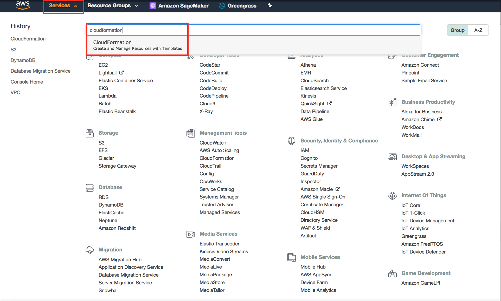


## Creating a stack on AWS

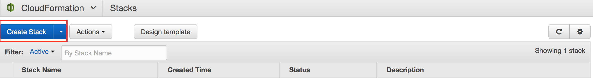


## Pulling the data from the Cloud Formation template

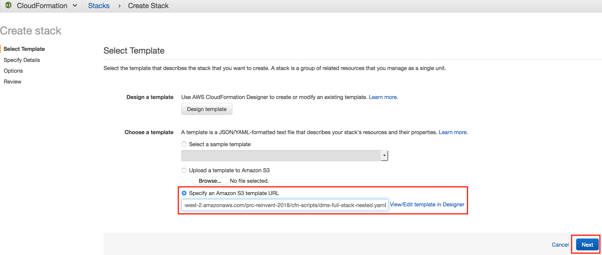


## Creating a stack 


The only change here would be accessing from the above picture is that we are operating from the EAST-1 region of AWS.


## Looking for the status of DMS Stack


## Looking for the status of DMS and verifying whether the load complete status

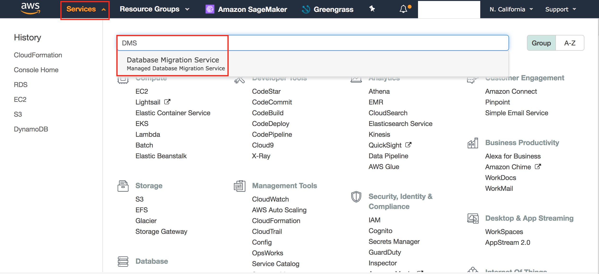

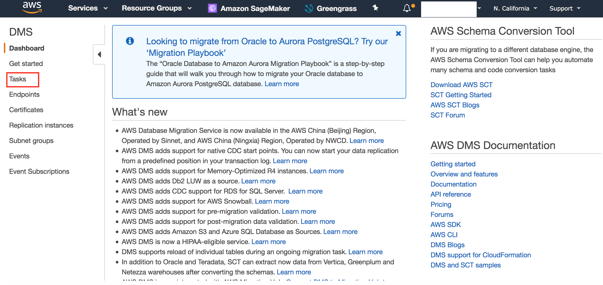

## Verifying whether the load complete is successful 


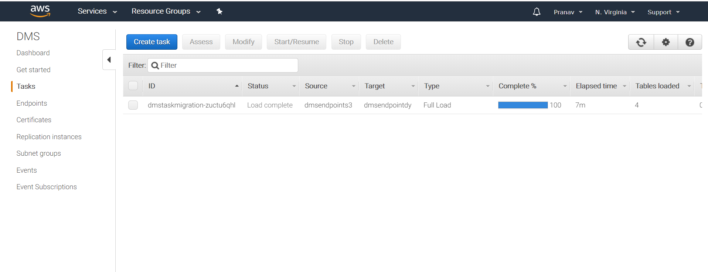

## Looking at the tables on DynamoDB

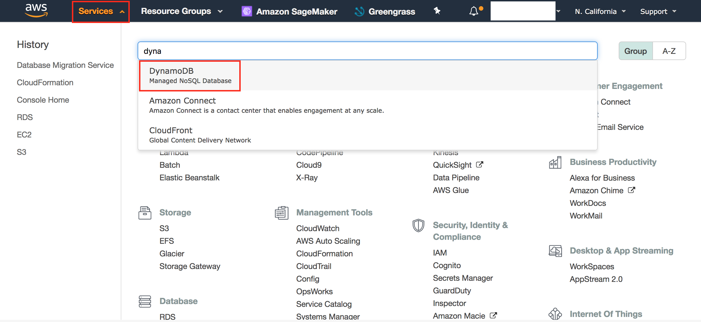

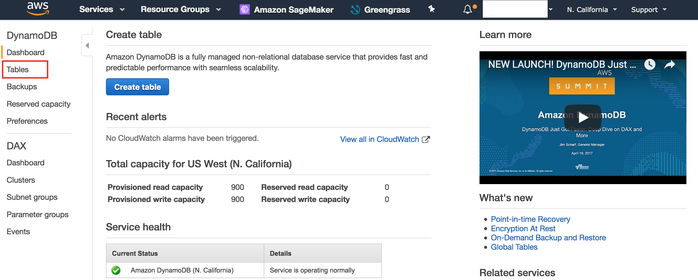

## Reporting the results on Dynamo DB

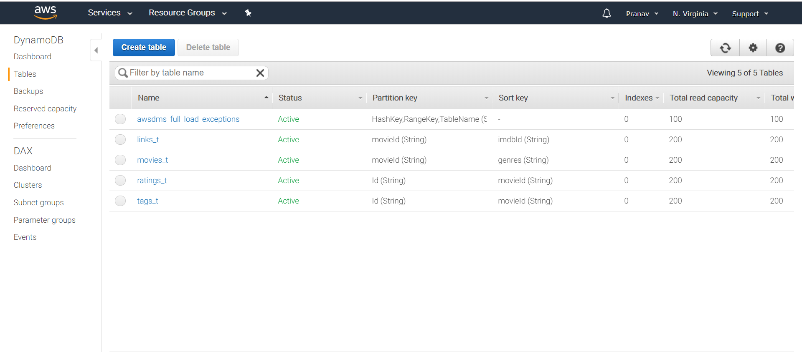


## Accessing the S3 bucket

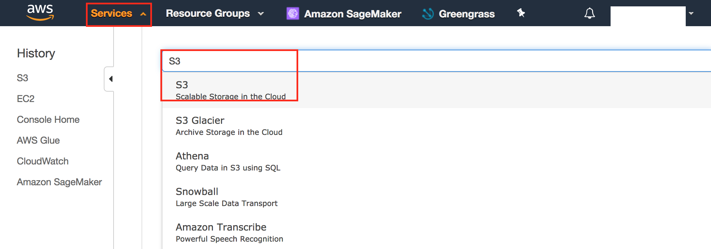

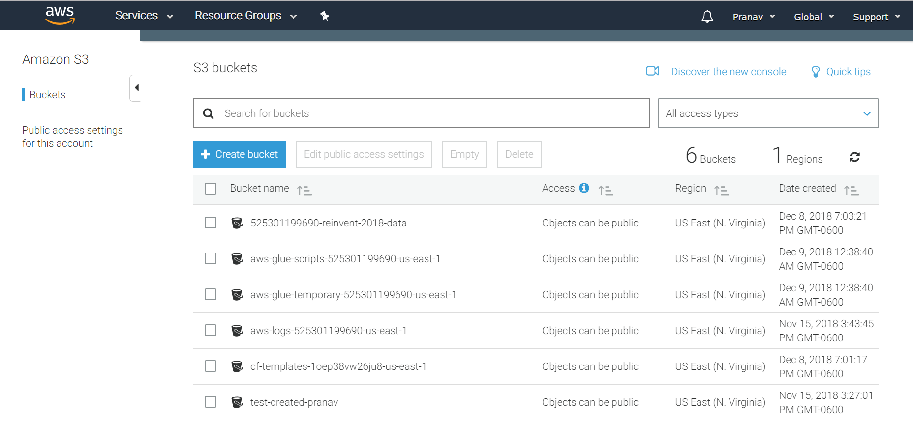

The data is loaded into the bucket "525301199690-reinvent-2018-data"

## Create a Kinesis Firehose Stream

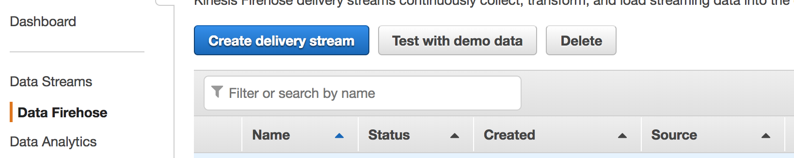

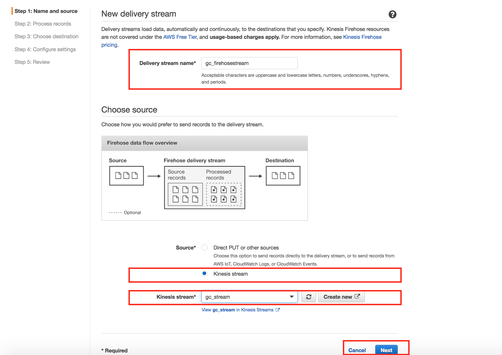

## Streaming

Now that we have loaded all the data on S3 bucket. We want the create a static data simulator of our ratings data using AWS Kinesis, AWS Lambda and finally putting the data on the S3 bucket.

**AWS Lambda** lets you run code without provisioning or managing servers. You pay only for the compute time you consume - there is no charge when your code is not running. With Lambda, you can run code for virtually any type of application or backend service - all with zero administration. Just upload your code and Lambda takes care of everything required to run and scale your code with high availability. You can set up your code to automatically trigger from other AWS services or call it directly from any web or mobile app.


**Amazon Kinesis** makes it easy to collect, process, and analyze real-time, streaming data so you can get timely insights and react quickly to new information. Amazon Kinesis offers key capabilities to cost-effectively process streaming data at any scale, along with the flexibility to choose the tools that best suit the requirements of your application. With Amazon Kinesis, you can ingest real-time data such as video, audio, application logs, website clickstreams, and IoT telemetry data for machine learning, analytics, and other applications. Amazon Kinesis enables you to process and analyze data as it arrives and respond instantly instead of having to wait until all your data is collected before the processing can begin.


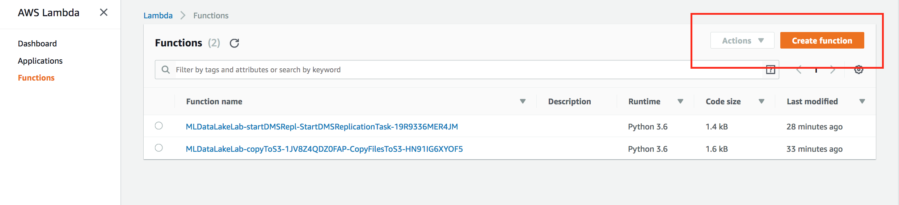

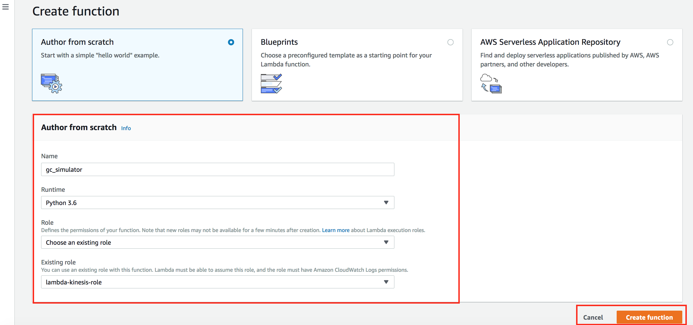

The following code has to be pasted in lamba_function.py of the created function

```{r lambda, eval=FALSE}
import json
import datetime
import random
import boto3
import csv
import io

kinesis = boto3.client('kinesis', region_name='us-east-1')

def lambda_handler(event, context):

    bigdataStreamName = "gc_stream"
    s3 = boto3.client('s3')
    response = s3.get_object(Bucket="test-created-pranav", Key="data/partial-load/ratings-partial-load.csv")
    tsv =  str(response['Body'].read().decode('UTF-8'))
    lines = tsv.split("/n")
    for line in tsv.split("/n"):
        val = line.split(",")
        data = json.dumps(getRating(val[0], val[1], val[2], val[3]))
        kinesis.put_record(StreamName=bigdataStreamName, Data=data, PartitionKey="rating")
    return "complete"

def getRating(userId, itemId, ratingId, timestamp):
    data = {}
    data['userid'] = userId
    data['movieid'] = itemId
    data['ratingid'] = ratingId
    data['timestamp'] = timestamp
    return data

```


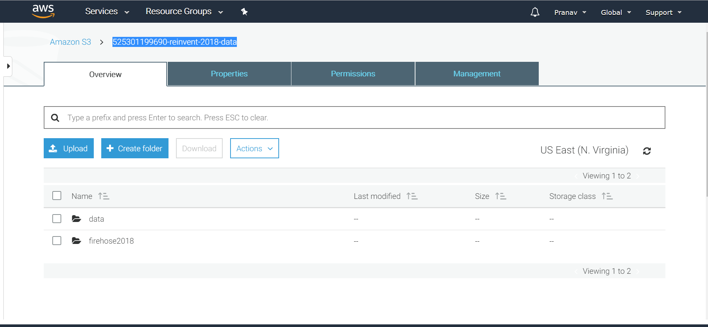

## Using Amazon Glue to transform the data from the S3 and DynamoDB 

We do three steps in this exercise:

* Populating the s3 glue data catalog
* Populating the dynamodb glue data catalog
* Transform data from Glue

The **AWS Glue Data Catalog** is an index to the location, schema, and runtime metrics of your data. It contains references to data that is used as sources and targets of your extract, transform, and load (ETL) jobs in AWS Glue. The Data Catalog is a drop-in replacement for the Apache Hive Meta-store and provides a uniform repository where disparate systems can store and find metadata to keep track of data, and use that metadata to query and transform the data. To populate the data catalog, we need to first create a role with proper permissions and then a crawler to take inventory of the data in our S3 bucket and Dynadb tables.


We are using the Amazon Glue to the following tasks to our tables:

* Changing the data types
* String cleaning
* Sorting

**Amazon Web Services Glue** is a fairly new product that introduces a fully managed Extract Transform Load (ETL) solution. It is very dynamic and even generates column mappings from one data store to the new creation and automatically scales, provisions and runs ETL jobs for you without you having to designate resources or scale things up and down to handle different loads. It also helps generate python scripts that will handle the execution of that job you setup. It's a pretty slick tool especially if you've tried to do any custom ETL solutions beforehand, and it's dirt cheap as most AWS products seem to be.

### Populating the s3 glue data catalog

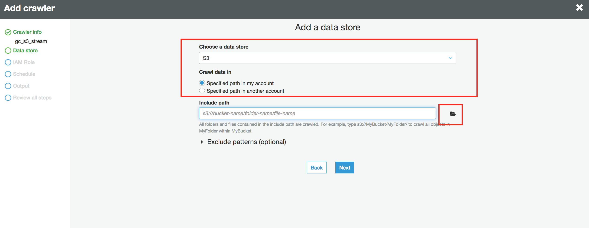

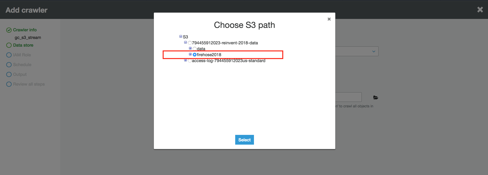


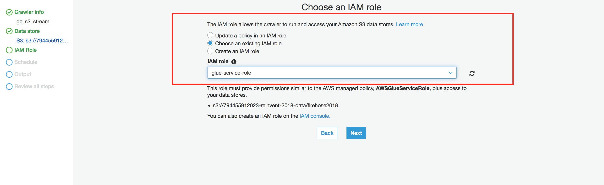


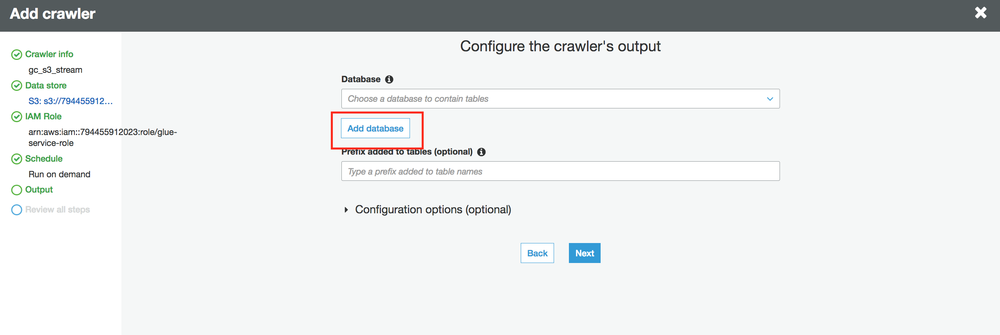


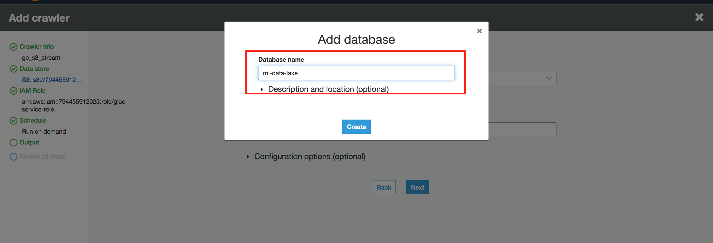


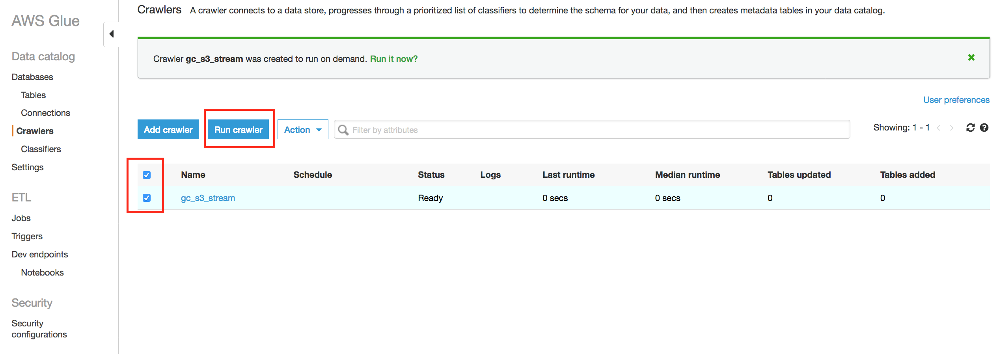


### Populating the dynamodb glue data catalog


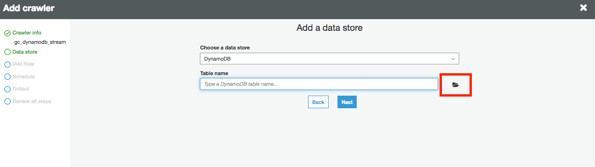


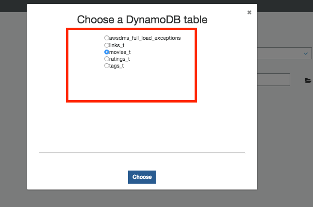


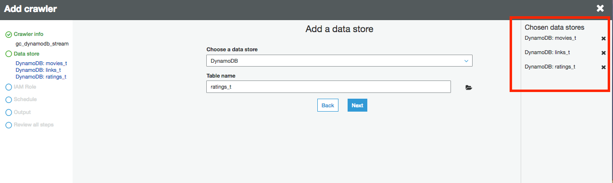


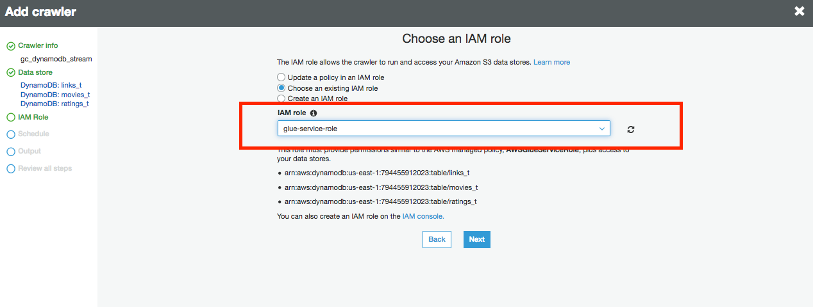


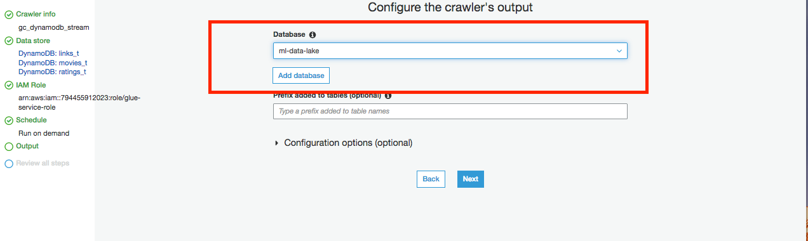


The tables in the Amazon Glue

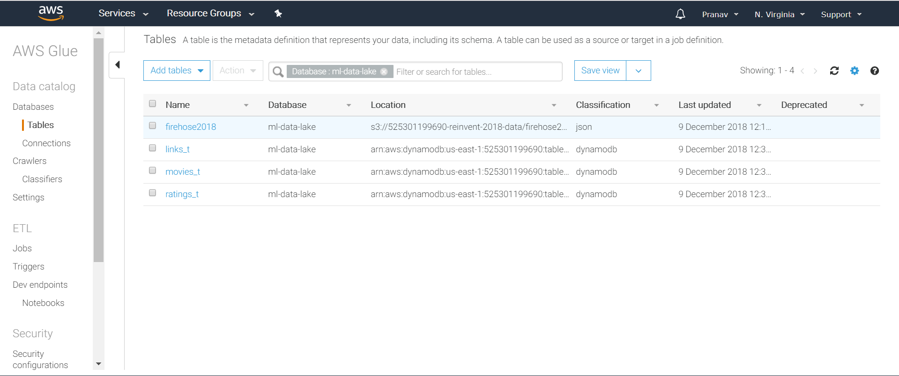

###   Script to transform data from Glue
```{r GLUE, eval=FALSE }
import sys
from awsglue.transforms import *
from awsglue.utils import getResolvedOptions
from pyspark.context import SparkContext
from awsglue.context import GlueContext
from awsglue.dynamicframe import DynamicFrame
from awsglue.job import Job
from pyspark.sql.functions import asc
from pyspark.sql.functions import expr
from pyspark.sql.functions import regexp_replace, col

## @params: [JOB_NAME]
args = getResolvedOptions(sys.argv, ['JOB_NAME'])

sc = SparkContext()
glueContext = GlueContext(sc)
spark = glueContext.spark_session
job = Job(glueContext)
job.init(args['JOB_NAME'], args)
s3_bucket = "test-created-pranav"
## @type: DataSource

datesource_s3_ratings = glueContext.create_dynamic_frame.from_catalog(database = "ml-data-lake", table_name = "firehose2018", transformation_ctx = "datesource_s3_ratings")
datasource_ratings = glueContext.create_dynamic_frame.from_catalog(database = "ml-data-lake", table_name = "ratings_t", transformation_ctx = "datasource_ratings")
datasource_movies = glueContext.create_dynamic_frame.from_catalog(database = "ml-data-lake", table_name = "movies_t", transformation_ctx = "datasource_movies")
datasource_links = glueContext.create_dynamic_frame.from_catalog(database = "ml-data-lake", table_name = "links_t", transformation_ctx = "datasource_links")

#s3_ratings
datasource0 = datesource_s3_ratings.toDF()
datasource0 = datasource0.withColumn("userid", expr("CAST(userid AS INTEGER)"))
datasource0 = datasource0.withColumn("movieid", expr("CAST(movieid AS INTEGER)"))
datasource0 = datasource0.select(["userid", "movieid", "ratingid", "timestamp"])
datasource0 = datasource0.filter(datasource0["userid"].isNotNull())


#ratings
datasource1 = datasource_ratings.toDF()
datasource1 = datasource1.withColumn("timestamp_c",regexp_replace("timestamp_c", "/"", ""))
datasource1 = datasource1.withColumn("userid", expr("CAST(userid AS INTEGER)"))
datasource1 = datasource1.withColumn("movieid", expr("CAST(movieid AS INTEGER)"))
datasource1 = datasource1.select(["userid", "movieid", "rating", "timestamp_c"])
datasource1 = datasource1.filter(datasource1["userid"].isNotNull())


dfUnion = datasource1.union(datasource0).sort(asc("userid"),asc("movieid"))
dfUnion.coalesce(1).write.option("header", "true").csv("s3://" + s3_bucket + "/ml/trainingdata/rating_new")


#movies
datasource2 = datasource_movies.toDF()
datasource2 = datasource2.withColumn("movieid", expr("CAST(movieid AS INTEGER)"))
datasource2 = datasource2.withColumn("genres",regexp_replace("genres", "/"", ""))
datasource2 = datasource2.withColumn("title",regexp_replace("title", "/"", ""))
datasource2 = datasource2.select(["movieid", "title", "genres"]).sort(asc("movieid"))
datasource2 = datasource2.filter(datasource2["movieid"].isNotNull())

datasource2.coalesce(1).write.option("header", "true").csv("s3://" + s3_bucket + "/ml/trainingdata/movies_new")

#links
datasource3 = datasource_links.toDF()
datasource3 = datasource3.withColumn("movieid", expr("CAST(movieid AS INTEGER)"))
datasource3 = datasource3.withColumn("tmdbid",regexp_replace("tmdbid", "/"", ""))
datasource3 = datasource3.select(["movieid", "imdbid", "tmdbid"]).sort(asc("movieid"))
datasource3 = datasource3.filter(datasource3["movieid"].isNotNull())

datasource3.coalesce(1).write.option("header", "true").csv("s3://" + s3_bucket + "/ml/trainingdata/links_new")


job.commit()

```

The transformed data is saved to s3 bucket which will fed into Amazon ML algorith Amazon SageMaker in the next step.


## References
1. https://grouplens.org/datasets/movielens/
