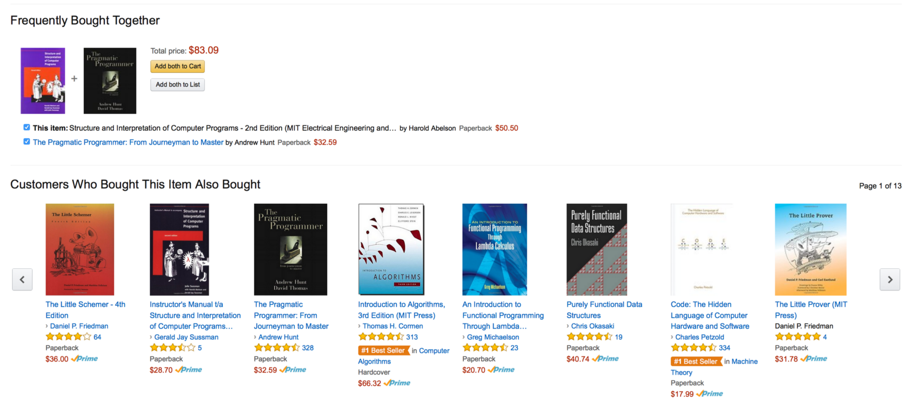
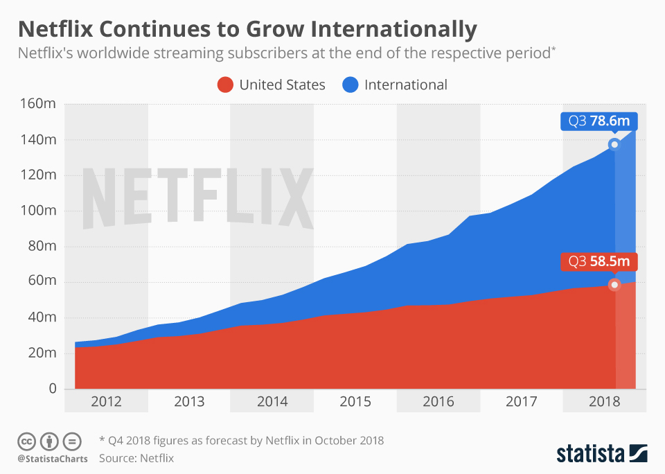
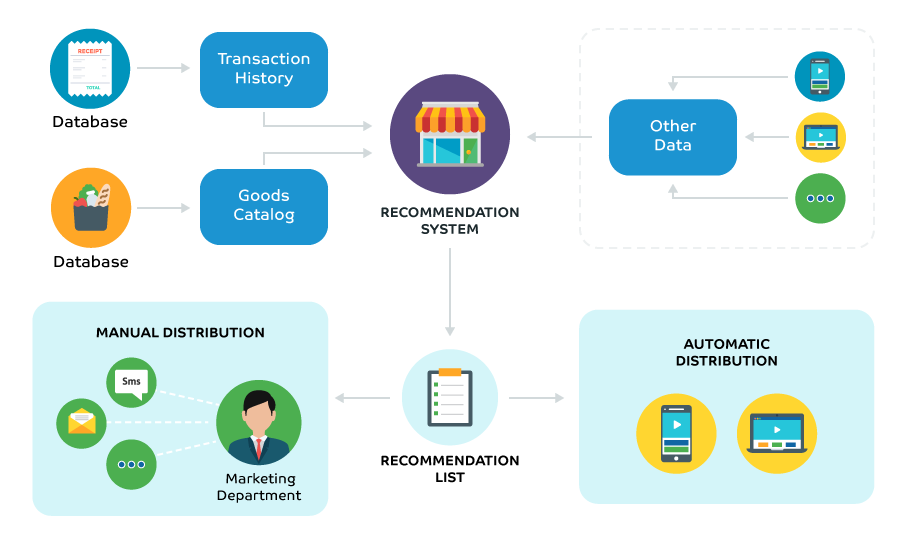
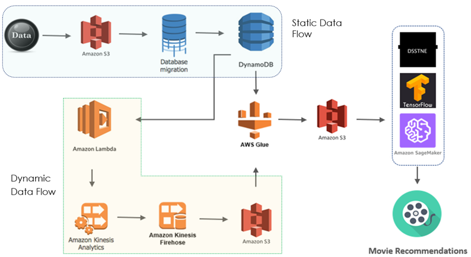

# Deep Scalable Recommender Systems AWS
Our goal is to prototype deep scalable recommender systems on AWS.

## What are recommender systems?
Most of us have experienced the power of personalized recommendations firsthand. Maybe you found former colleagues and classmates with LinkedIn’s “People You May Know” feature. Perhaps you watched a movie because Netflix suggested it to you. And you’ve most likely bought something that Amazon recommended under “Frequently Bought Together” or “Customers Who Bought This”. Simply put it is a mechanism to recommend items or services to the customer based on their interests or of their look-a-likes to offer personalization. Below is an all too familiar example of how product recommendations look like in Amazon.

## Why are recommender systems important?

The age of search has come to an end. The competitive advantage of companies is slowly changing from having all information to being able to recommend relevant information to its users. This is especially relevant because of today's information overload.

- Chirs Anderson in “The Long Tail”:
We are leaving the age of information and entering the age of 	recommendation

- CNN Money, “The race to create a ‘smart’ Google”:
The Web, they say, is leaving the era of search and entering one of discovery. 	What's the difference? Search is what you do when you're looking for something. Discovery is when something wonderful that you didn't know existed, 	or didn't know how to ask for, finds you.

It is no longer a competitive advantage for companies to have content but they need to be able to deliver their content personalized to their users. Companies like Netflix and Spotify are not successful because they have a wide variety of movies or songs but because they are able to recommend to their user's movies and songs that they would enjoy the most.
 
Recommendation engines account for a huge share of revenue and user activity, often 30 to 50 percent, for instance, 35 percent of what consumers purchase on Amazon, 75 percent of what they watch on Netflix and 38% of visits on Google news links come from product recommendations based on highly personalized marketing of which recommender systems play a large part. 

## Why Big Data?

Without a doubt, big data is the driving force behind recommender systems. A good recommender engine should be reliable, scalable, highly available, and be able to provide personalized recommendations, in real time, to the large user base it contains. There has been a large advancement of the algorithms in the recommender system space but their scalable implementations are still lacking in some sense. A famous example is the $1 million prize that Netflix awarded to a developer team in 2009 for an algorithm that increased the accuracy of the company's recommendation engine by 10 percent. Netflix never used the winning solution due to "engineering costs", according to Netflix the increase in accuracy on the winning improvements "did not seem to justify the engineering effort needed to bring them into a production environment," according to their blog post. This goes to highlight the importance of scaling recommender systems. Looking at the rate at which Netflix’s customer base has been increasing over the years, they do not just need an accurate recommender system in place, but also the infrastructure to support and scale it to the level of big data.

## Process Pipeline

The below diagram represents the flow of a typical recommender system. A recommender system primarily gets data for users and their preferences from transactions and the organization’s catalog. The former being static while the latter would be dynamic. Static data is information at rest, information that is not generated or modified often. For example, goods catalog or the list of products present is an example of static data. Dynamic data is information that is continuously being generated. For example, customer purchases from this goods catalog. This transactional information is generated on a real-time basis. On the top right, there are certain secondary sources of data in addition to the primary data sources. Additional data, like the type of device the customer used to access their catalog, can also be incorporated. The final recommendation list generated can either be consumed by the marketing department to tailor messages for their target segment or is used for automatic distribution of content among users.

Source: [Dzone](https://dzone.com/articles/powered-by-ai-how-to-use-recommendation-system-in)

## Implementation on AWS

We used AWS to replicate parts of the above pipeline. More information about the preprocessing elements of the pipeline can be found [here](Preprocessing_Pipeline.md).

## Two ways of implementation based on complexity vs scalability

1. [Amazon Sagemaker](SageMaker)
2. [DSSTNE](DSSTNE) 

## Conclusion

We conclude that DSSTNE is complex and scalable while SageMaker is simple but hard to scale.

## References
1. https://www.mckinsey.com/industries/retail/our-insights/how-retailers-can-keep-up-with-consumers
2. https://medium.com/ai-society/a-concise-recommender-systems-tutorial-fa40d5a9c0fa
3. https://www.wired.com/2012/04/netflix-prize-costs/
