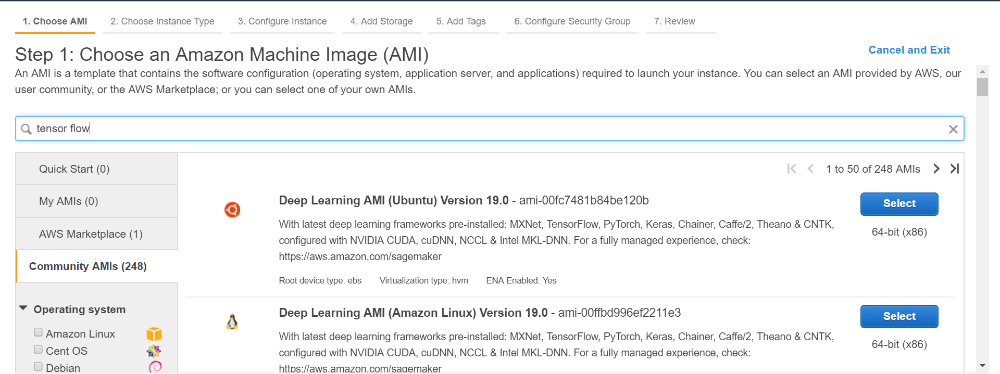
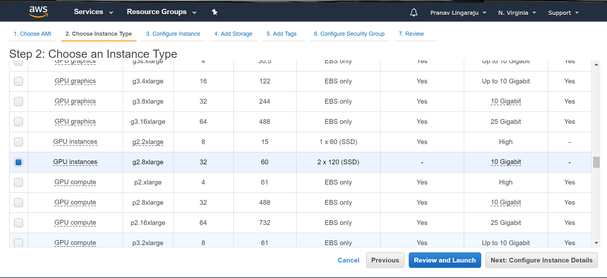
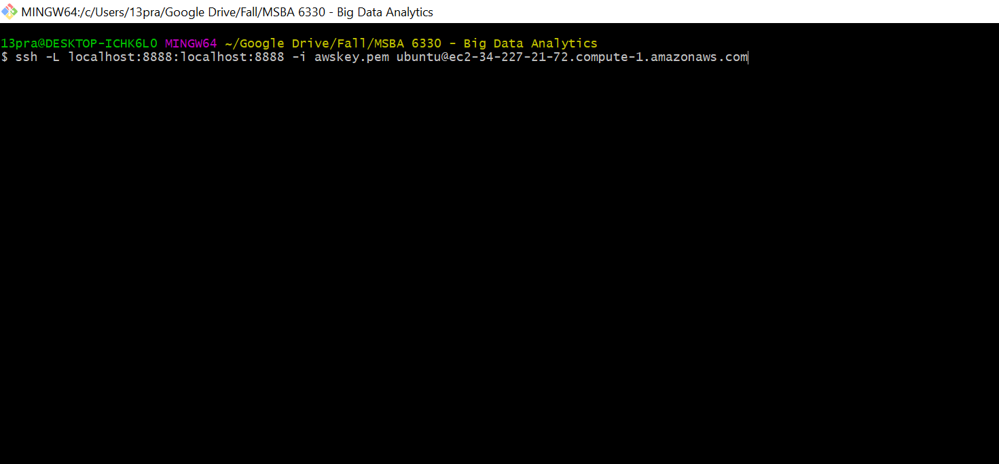

# Recommender Systems on TensorFlow - Walkthrough

To compare the performance of DSSTNE we built a recommender system on TensorFlow using the same network structure.

## Setup

### Launch an EC2 instance from AWS Marketplace

Start an EC2 GPU-based instance from AWS marketplace. We select an instance with pre-installed Tensorflow, 
python packages from the community AMI's by searching for tensorflow. This procedure also skips the customization of the instance to handle TensorFlow.

We chose 'Deep Learning AMI (Ubuntu) Version 19.0 - ami-00fc7481b84be120b' AMI from [here](https://console.aws.amazon.com/ec2/v2/home?region=us-east-1#LaunchInstanceWizard:).
This AMI has latest deep learning frameworks pre-installed: MXNet, TensorFlow, PyTorch, Keras, Chainer, Caffe/2, Theano & CNTK, configured with NVIDIA CUDA, cuDNN, NCCL & Intel MKL-DNN and is currently available in the us-east-1 region (N.Virginia in AWS Console).




Then chose the GPU based instance.



Select the other attributes of the instance as per the requirement and
launch it. For the purposes of this demo, only the storage was modified
to 200GB from the default values setup

SSH into the cluster from the location where the private key is located
    
 

## Running the recommender system

#### Downloading the dataset

For this example, we will generate movie recommendations based on the [MovieLens](https://grouplens.org/datasets/movielens/) dataset.

```{bash, eval=FALSE}
!wget http://files.grouplens.org/datasets/movielens/ml-10m.zip
#unzip 
!unzip ml-10m.zip
```

We then import all the python libraries and TensorFlow libraries required for a deep neural network.

```{python, eval = FALSE, python.reticulate = FALSE}
# Importing tensorflow
import tensorflow as tf
# Importing some more libraries
import pandas as pd
import numpy as np
import matplotlib.pyplot as plt
from sklearn.model_selection import train_test_split
from sklearn.metrics import mean_squared_error as MSE


```

We now read the ratings data and pivot that to get each review at a user level.

```{python, eval=FALSE, python.reticulate = FALSE}
# reading the ratings data
ratings = pd.read_csv('ml-10M100K/ratings.dat',\
          sep="::", header = None, engine='python')
# pivot the data to get it at a user level
ratings_pivot = ratings[[0,1,2]].pivot(values=2, index=0, columns=1 ).fillna(0)
# creating train and test sets
X_train, X_test = train_test_split(ratings_pivot, train_size=0.8)
```


Decide the number of nodes that need to be set on each layer of the neural network.

```{python, eval=FALSE, python.reticulate = FALSE}
# Deciding how many nodes each layer should have
n_nodes_inpl = 10677  
n_nodes_hl1  = 256  
n_nodes_outl = 10677  
# first hidden layer has 784*32 weights and 32 biases
hidden_1_layer_vals = {'weights':tf.Variable(tf.random_normal([n_nodes_inpl+1,n_nodes_hl1]))}
output_layer_vals = {'weights':tf.Variable(tf.random_normal([n_nodes_hl1+1,n_nodes_outl])) }

```


Set up the neural network

```{python, eval=FALSE, python.reticulate = FALSE}
# user with 3706 ratings goes in
input_layer = tf.placeholder('float', [None, 10677])
# add a constant node to the first layer
# it needs to have the same shape as the input layer for me to be
# able to concatinate it later
input_layer_const = tf.fill( [tf.shape(input_layer)[0], 1] ,1.0  )
input_layer_concat =  tf.concat([input_layer, input_layer_const], 1)
# multiply output of input_layer wth a weight matrix 
layer_1 = tf.nn.sigmoid(tf.matmul(input_layer_concat,\
hidden_1_layer_vals['weights']))
# adding one bias node to the hidden layer
layer1_const = tf.fill( [tf.shape(layer_1)[0], 1] ,1.0  )
layer_concat =  tf.concat([layer_1, layer1_const], 1)
# multiply output of hidden with a weight matrix to get final output
output_layer = tf.matmul( layer_concat,output_layer_vals['weights'])
# output_true shall have the original shape for error calculations
output_true = tf.placeholder('float', [None, 10677])
# define our cost function
meansq =    tf.reduce_mean(tf.square(output_layer - output_true))
# define our optimizer
learn_rate = 0.1   # how fast the model should learn
optimizer = tf.train.AdagradOptimizer(learn_rate).minimize(meansq)
```
Initialise variables and start session.

```{python, eval=FALSE, python.reticulate = FALSE}
# initialising variables and starting the session
init = tf.global_variables_initializer()
sess = tf.Session()
sess.run(init)
# defining batch size, number of epochs and learning rate
batch_size = 256  # how many images to use together for training
hm_epochs =10    # how many times to go through the entire dataset
tot_images = X_train.shape[0] # total number of images
```

Running the model for 10 epochs taking 256 users in batches.

```{python, eval=FALSE, python.reticulate = FALSE}

# total improvement is printed out after each epoch
def execute():
    for epoch in range(hm_epochs):
        epoch_loss = 0    # initializing error as 0

        for i in range(int(tot_images/batch_size)):
            epoch_x = X_train[ i*batch_size : (i+1)*batch_size ]
            _, c = sess.run([optimizer, meansq],\
                   feed_dict={input_layer: epoch_x, \
                   output_true: epoch_x})
            epoch_loss += c

        output_train = sess.run(output_layer,\
                   feed_dict={input_layer:X_train})
        output_test = sess.run(output_layer,\
                       feed_dict={input_layer:X_test})

        print('MSE train', MSE(output_train, X_train),'MSE test', MSE(output_test, X_test))      
        print('Epoch', epoch, '/', hm_epochs, 'loss:',epoch_loss)
```


Calling the execute function

```{python, eval=FALSE, python.reticulate = FALSE}
execute()
```


Getting the time to train using %timeit.

```{python, eval=FALSE, python.reticulate = FALSE}
%timeit execute()
```
## Results

For 10 million reviews we get '5min 19s ± 1.19 s per loop (mean ± std. dev. of 7 runs, 1 loop each)' time which is 16 times slower than DSSTNE.


## References

1) https://medium.com/@connectwithghosh/recommender-system-on-the-movielens-using-an-autoencoder-using-tensorflow-in-python-f13d3e8d600d
2) https://aws.amazon.com/blogs/machine-learning/get-started-with-deep-learning-using-the-aws-deep-learning-ami/
